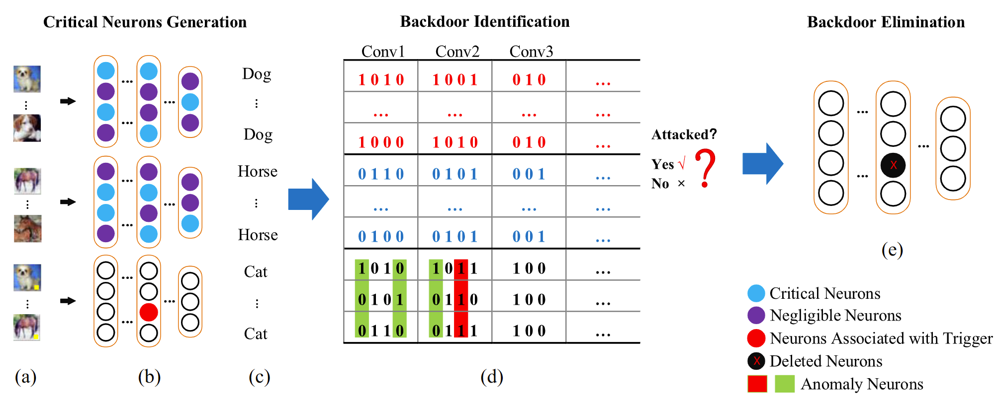
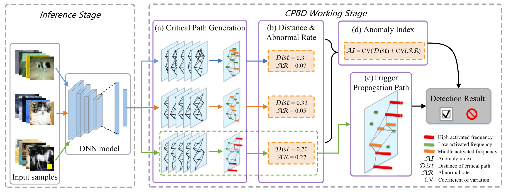
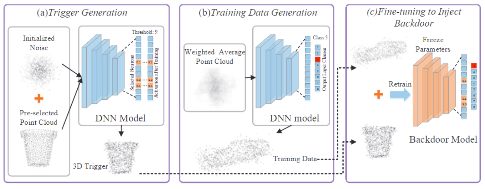
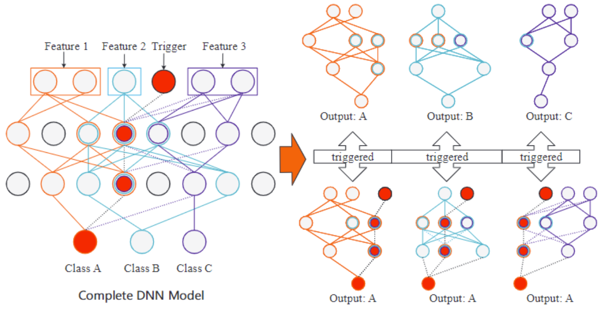








Hello, my name is Wen Xiangyu. I was admitted to the Department of Computer Science and Engineering, The Chinese University of Hong Kong as a first-year Ph.D. student. Now I am studying in the CUHK REliable Computing laboratory (CURE Lab.) and my supervisor is Prof. XU Qiang. Prior to this, I got my Bachelor's and Master's Degrees (supervised by A.P. Jiang Wei) in University of Electronic Science and Technology of China. My research interests are about Deep learning and AI security.

# 🔥 News
- *2022.11*: &nbsp;🎉🎉 Won 2nd place in the International Algorithm Case Competition. 

# 📝 Publications 

TCAD 2021

[Interpretability-guided defense against backdoor attacks to deep neural networks](https://ieeexplore.ieee.org/abstract/document/9530722)

Wei Jiang\*, **Xiangyu Wen\***, Jinyu Zhan, Xupeng Wang, Ziwei Song

<!-- [**Project**](https://scholar.google.com/citations?view_op=view_citation&hl=zh-CN&user=DhtAFkwAAAAJ&citation_for_view=DhtAFkwAAAAJ:ALROH1vI_8AC) <strong></strong>
- Lorem ipsum dolor sit amet, consectetur adipiscing elit. Vivamus ornare aliquet ipsum, ac tempus justo dapibus sit amet.  -->

TNNLS 2022

[Critical Path-Based Backdoor Detection for Deep Neural Networks](https://ieeexplore.ieee.org/abstract/document/9882007)

Wei Jiang\*, **Xiangyu Wen\***, Jinyu Zhan, Xupeng Wang, Ziwei Song, Chen Bian

<!-- [**Project**](https://scholar.google.com/citations?view_op=view_citation&hl=zh-CN&user=DhtAFkwAAAAJ&citation_for_view=DhtAFkwAAAAJ:ALROH1vI_8AC) <strong></strong>
- Lorem ipsum dolor sit amet, consectetur adipiscing elit. Vivamus ornare aliquet ipsum, ac tempus justo dapibus sit amet.  -->

EMSOFT 2021

[Work-in-Progress: Generative Strategy based Backdoor Attacks to 3D Point Clouds](https://ieeexplore.ieee.org/abstract/document/9589486)

**Xiangyu Wen**, Wei Jiang, Jinyu Zhan, Chen Bian, Ziwei Song

<!-- [**Project**](https://scholar.google.com/citations?view_op=view_citation&hl=zh-CN&user=DhtAFkwAAAAJ&citation_for_view=DhtAFkwAAAAJ:ALROH1vI_8AC) <strong></strong>
- Lorem ipsum dolor sit amet, consectetur adipiscing elit. Vivamus ornare aliquet ipsum, ac tempus justo dapibus sit amet.  -->

EMSOFT 2020

[Interpretability Derived Backdoor Attacks Detection in Deep Neural Networks: Work-in-Progress](https://ieeexplore.ieee.org/abstract/document/9244019)

**Xiangyu Wen**, Wei Jiang, Jinyu Zhan, Xupeng Wang, Zhiyuan He

<!-- [**Project**](https://scholar.google.com/citations?view_op=view_citation&hl=zh-CN&user=DhtAFkwAAAAJ&citation_for_view=DhtAFkwAAAAJ:ALROH1vI_8AC) <strong></strong>
- Lorem ipsum dolor sit amet, consectetur adipiscing elit. Vivamus ornare aliquet ipsum, ac tempus justo dapibus sit amet.  -->

- [Optimized co-scheduling of mixed-precision neural network accelerator for real-time multitasking applications](https://www.sciencedirect.com/science/article/pii/S1383762120300692), Wei Jiang, Ziwei Song, Jinyu Zhan, Zhiyuan He, Xiangyu Wen, Ke Jiang, **Journal of Systems Architecture 2020**
- [Work-in-Progress: A Physically Realizable Backdoor Attack on 3D Point Cloud Deep Learning](https://ieeexplore.ieee.org/abstract/document/9603381), Chen Bian, Wei Jiang, Jinyu Zhan, Ziwei Song, Xiangyu Wen, Hong Lei, **CODES+ISSS 2021**
- [Work-in-Progress: Critical-Weight Based Locking Scheme for DNN IP Protection in Edge Computing](https://ieeexplore.ieee.org/abstract/document/9603370), Ziwei Song, Wei Jiang, Jinyu Zhan, Xiangyu Wen, Chen Bian, **CODES+ISSS 2021**
- [Heatmap-Aware Low-Cost Design to Resist Adversarial Attacks: Work-in-Progress](https://ieeexplore.ieee.org/abstract/document/9244017), Zhiyuan He, Wei Jiang, Jinyu Zhan, Xupeng Wang, Xiangyu Wen, **CODES+ISSS 2020**

# 🎖 Honors and Awards
- *2022.11* Won 2nd. place in the International Algorithm Case Competition. 
- *2022.08* Full Postgraduate Studentship, The Chinese University of Hong Kong.
- *2022.03* Won Outstanding Graduates of Sichuan Province.
- *2021.12* Won National Scholarship.
- *2021.12* Won Outstanding Graduates of University of Electronic Science and Technology of China.
- *2021.11* Won First Class Scholarship of 2021.
- *2021.06* Won Academic Newcomer Title.
- *2020.11* Won First Class Scholarship of 2020.
- *2018.12* Won Second Class Scholarship of 2018.
- *2018.04* Was designated as Meritorious Winner in Interdisciplinary Contest In Modeling (MCM/ICM).
- *2017.12* Won Second Class Scholarship of 2017.
- *2016.12* Won National Encouragement scholarship. 

# 📖 Educations
- *2022.08 - now*, as a Ph. D. Student in the Department of Computer Science and Engineering, the Chinese University of Hong Kong. 
- *2019.09 - 2022.06*, as a Master student in University of Electronic Science and Technology of China. 
- *2015.09 - 2019.06*, as a Undergraduate student in University of Electronic Science and Technology of China. 

<!-- # 💬 Invited Talks
- *2021.06*, Lorem ipsum dolor sit amet, consectetur adipiscing elit. Vivamus ornare aliquet ipsum, ac tempus justo dapibus sit amet. 
- *2021.03*, Lorem ipsum dolor sit amet, consectetur adipiscing elit. Vivamus ornare aliquet ipsum, ac tempus justo dapibus sit amet.  \| [\[video\]](https://github.com/) -->

# 🏫 Teaching Assitants
- *2023.01 - 2023.04*, TA of Embedded System Development and Applications (CENG4480).
- *2022.09 - 2022.12*, TA of Embedded System Design (CENG2400).

# 💻 Internships
- *2018.12 - 2019.04*, [Jeejio](https://www.jeejio.com/), China.
- *2018.01 - 2018.08*, [Chengdu Lian'an](https://www.lianantech.com/#/index?index=0), China.
